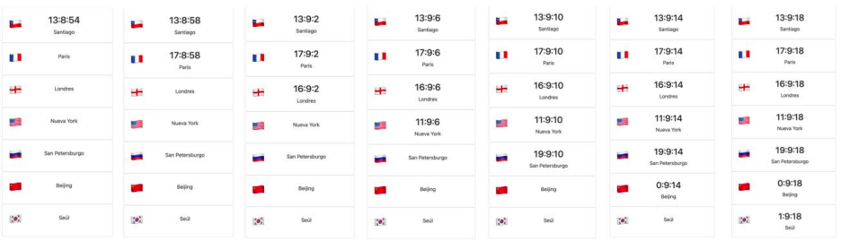

# Horas alrededor del mundo

EJERCICIO:
En la siguiente actividad, practicaremos el uso de JavaScript asincrónico para crear una página web que muestre la hora actual en diferentes lugares del mundo, incluyendo ciudades como: Santiago, París, Londres, Nueva York, San Petersburgo, Beijing y Seúl.
El diseño de esta página es bastante simple. Usando Bootstrap, crearemos una serie de bloques que incluirán: la bandera del país, el nombre de la ciudad capital, y la hora local de ese país. Tomando como referencia a Santiago de Chile, debes buscar las diferencias de horas con las demás ciudades. Y utilizando
setInterval(), debes poder ver el tiempo cambiando cada segundo en vivo.

